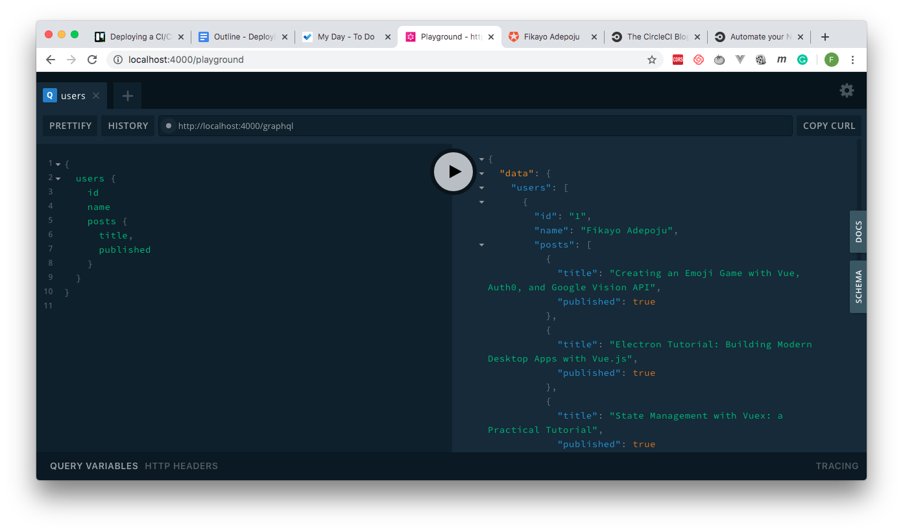

# A Simple Graphql Server Built with Nodejs

## Running the application

1. Install dependencies: `npm install`
2. Run the server: `npm start`
3. Playground is available at: http://localhost:4000/playground

**NB**: The server runs on a mocked Mongodb Database Server
